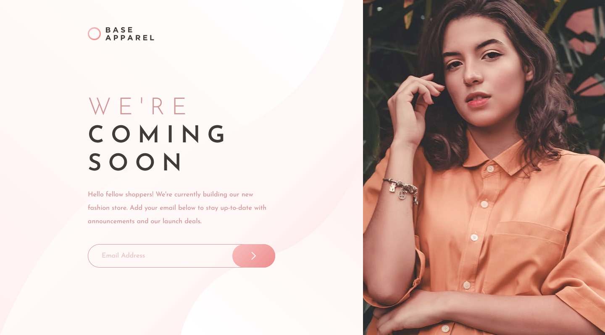
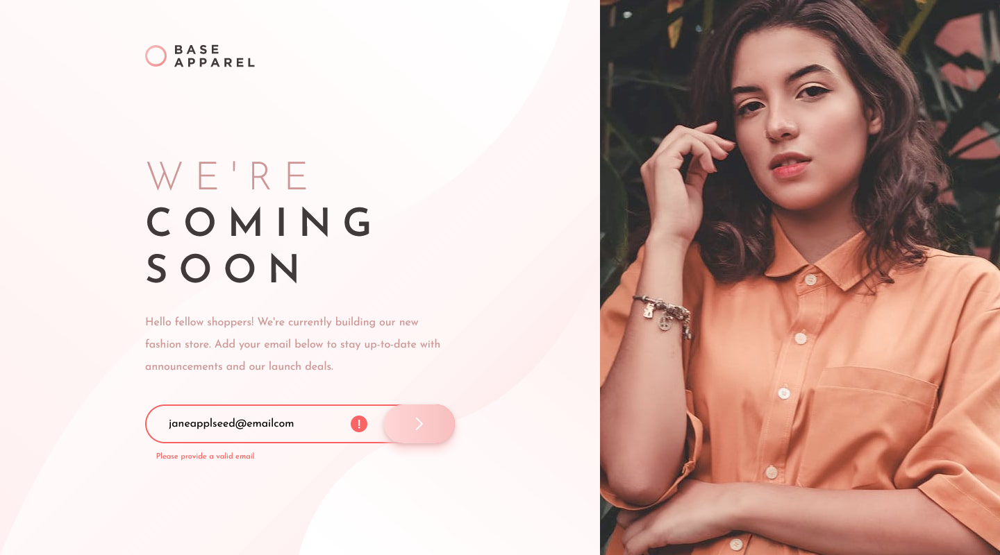
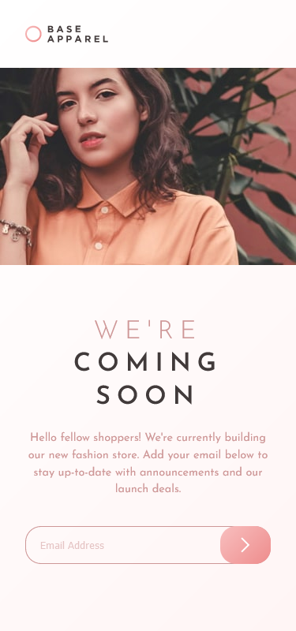
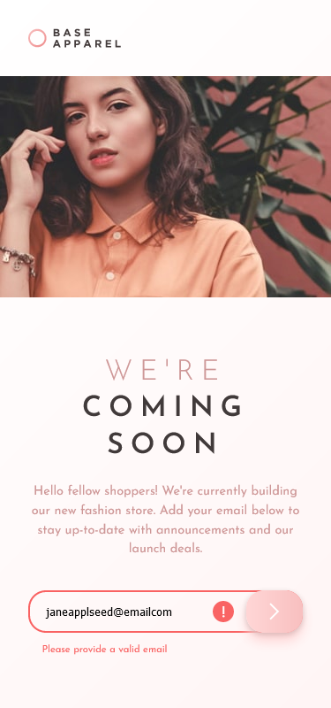

# Frontend Mentor - Base Apparel coming soon page solution

This is a solution to the [Base Apparel coming soon page challenge on Frontend Mentor](https://www.frontendmentor.io/challenges/base-apparel-coming-soon-page-5d46b47f8db8a7063f9331a0). Frontend Mentor challenges help you improve your coding skills by building realistic projects. 

## Table of contents

- [Frontend Mentor - Base Apparel coming soon page solution](#frontend-mentor---base-apparel-coming-soon-page-solution)
  - [Table of contents](#table-of-contents)
  - [Overview](#overview)
    - [The challenge](#the-challenge)
    - [Screenshot](#screenshot)
    - [Links](#links)
  - [My process](#my-process)
    - [Built with](#built-with)
    - [What I learned](#what-i-learned)
    - [Continued development](#continued-development)
    - [Useful resources](#useful-resources)
  - [Author](#author)
  - [Acknowledgments](#acknowledgments)

## Overview
Greetings Everyone! This project is made for the purpose of practicing and improving my CSS skills. 
This challenge is setup by [`Frontend Mentor`](https://www.frontendmentor.io/challenges/base-apparel-coming-soon-page-5d46b47f8db8a7063f9331a0). To know more about this challenge, read the *challenge.md*.

### The challenge

Users should be able to:

- View the optimal layout for the site depending on their device's screen size
- See hover states for all interactive elements on the page
- Receive an error message when the `form` is submitted if:
  - The `input` field is empty
  - The email address is not formatted correctly

**`Difficulty:`**` Newbie`

### Screenshot

Screen: `1440x800 desktop`

Screen: `1440x800 active state desktop`

Screen: `375x800 mobile`

Screen: `375x800 active state mobile`

### Links

- Solution URL: [Github repo url](https://github.com/almoratalla/Base-Apparel-coming-soon-page)
- Live Site URL: [My Github page](https://almoratalla.github.io/projects/learning/base-apparel-coming-soon)

## My process

### Built with

- Semantic HTML5 markup
- Flexbox
- Mobile-first workflow

### What I learned

My initial design choice for this single page is to either separate the image and the main section to separate containers or just keep it straight forward. But to keep it relatively simple, semantic and consistent, I just used a `global container` that will be a flex box that will hold its children into a column. The separation of the `image` and `main` section during desktop view depends on the `order` of the image to keep it on the right side.

### Continued development

I think this is pretty much done. Other possible continuation for this is the addition of connection to api's, connection to a newsletter service or storing of the email to a database

### Useful resources

- [Frontendmentor.io](https://www.frontendmentor.io/resources) - Frontendmentor itself has a list of great resources!.
- [MDN Web Docs](https://developer.mozilla.org/en-US/docs/Web/CSS/Reference) - Great reference for syntax and properties.
- [CSS reset](https://dev.to/hankchizljaw/a-modern-css-reset-6p3) - I don't follow this as a boilerplate but I use this as reference.
- [CSS Tricks!](https://css-tricks.com/snippets/css/a-guide-to-flexbox/) - Something I go back to as a reference for flexbox
- [Stack Overflow](https://stackoverflow.com/) - the ever loving!

## Author

- Website - [Alain Moratalla](https://github.com/almoratalla)
- Frontend Mentor - [@almoratalla](https://www.frontendmentor.io/profile/almoratalla)
- Twitter - [@almoratalla](https://twitter.com/almoratalla)

## Acknowledgments

I tip all the hats in the world for FrontEnd Mentor for giving these free challenges. I also would like to thank the one who picked this challenge for me, you inspire me to do better.

Lastly, thank you Rick for that great song! 
